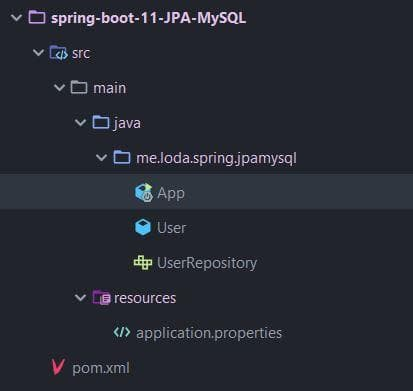

## Hướng dẫn Spring Boot JPA + MySQL
    Spring Boot JPA
    Controller -> Service -> Repository <--- Spring Boot JPA thay thế bước này.
    + Kiến thức bổ trợ
        Hibernate
        Lombok

## Spring Boot JPA
    + Spring Boot JPA là một phần trong hệ sinh thái Spring Data, nó tạo ra một layer ở giữa tầng Service và Database.
    Giúp chúng ta thao tác với Database một cách dễ dàng hơn, tự động config và giảm thiểu code thừa thãi trong quá trình phát triển.
    
    + Spring Boot JPA đã wrapper Hibernate và tạo ra một interface mạnh mẽ. Nếu như gặp khó khăn khi làm việc với Hibernate thì đừng lo, hãy để Spring JPA làm hộ.

## Cài đặt
    spring-boot-starter-data-jpa
    mysql-connector-java
    + Cấu trúc thư mục

## Tạo table và dữ liệu
    Tạo table
    Tạo procedure insert dữ liệu vào table
    
## Tạo Model User

## Vấn đề của Hibernate truyền thống
    Thông thường, khi đã định nghĩa Entity tương ứng với table trong Database thông qua Hibernate.
    Thì nhiệm vụ tiếp theo sẽ tạo ra các class thao tác với Database.
    
    + Mục đích ban đầu của Hibernate là giúp người lập trình dễ sử dụng, tuy nhiên cũng có nhiều trường hợp làm việc với Hibernate gặp khó khăn hơn cả JDBC core.
    + Để giải quyết vấn đề đó:
        Spring Data đã wapper lên Hibernate một lớp nữa gọi là Spring JPA, giúp cho mọi thao tác với Database của chúng rút ngắn xuống còn 1 dòng.
        Và tất nhiên là làm mờ Hibernate xuống đáng kể để tránh rắc rồi cho lập trình viên.
    + 
    

## JPARepository
    + Sử dụng JpaRepository
        cung cấp 2 thông tin:
        1. Entity của đối tượng tương ứng table trong Database.
        2. Kiểu dữ liệu khóa chính - primary key.
    

## Demo
    + Demo khởi tạo Database MySQL + bảng + fake Data.
    + Thực hiện Tạo User -> nó đóng vai trò là Model -> chịu trách nhiệm là dữ liệu trung chuyển giữa Service và Database.
    + Thực hiện tạo UserRepository -> JpaRepository -> thực hiện các method liên quan đến Database.
    + Thực hiện các thao tác CRUD basic với table đó.

## Câu hỏi:
    + Viết câu lệnh NativeSQL sẽ như thế nào
    + Hiraki đóng vai trò gì trong vụ kết nối này -> thấy có connection của nó.
    + Các bảng có quan hệ: 1-1, 1-N, N-N sẽ được thể hiện như thế nào trong JavaCode.
    + Các Annotation quan trong trong Hibernate cần phải hiểu.

## Reference document
    「Spring Boot #11」 Hướng dẫn Spring Boot JPA + MySQL   
    https://loda.netlify.app/spring-boot-11-huong-dan-spring-boot-jpa-my-sql-loda1558687596060/

