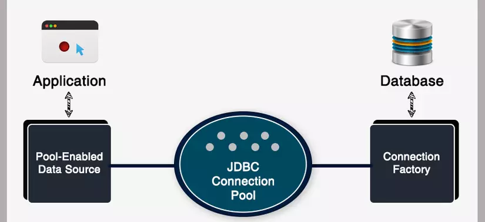

## Cấu hình Hikari Connection Pool trong Spring Boot

## Reference Document
    [1] Cấu hình Hikari Connectiion Pool
        https://viblo.asia/p/cau-hinh-hikari-connection-pool-trong-spring-boot-nhu-the-nao-eW65Gey6ZDO

    [2] HikariCP và Tomcat, DBCP2, C3P0, BoneCP, Vibur
        https://viblo.asia/p/hikaricp-va-tomcat-dbcp2-c3p0-bonecp-vibur-ke-tam-lang-nguoi-chua-toi-nua-gam-vyDZOYOk5wj

