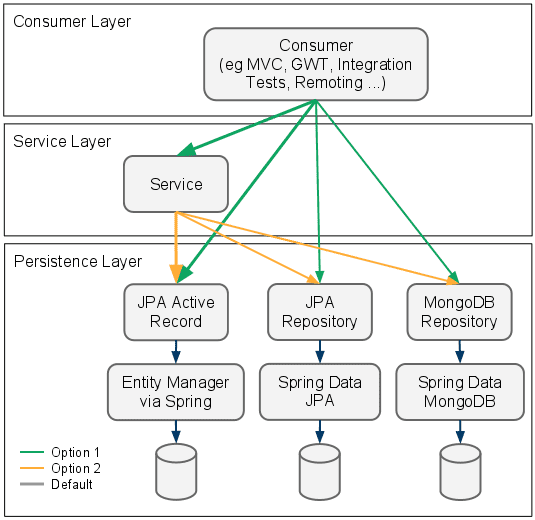

## Nếu không có @Service -> GirlService
    Cũng chỉ là một class Java bình thường.
    No qualifying bean of type 'com.component.service.impl.GirlService' available

## Nếu không có @Autowired in GirlService.java
    Thì sẽ không thể inject một Repository vào trong Service.
    -> Hoặc triển khai lại nó bằng cách khởi tạo đối tượng new.    

	@Service    -> gắn cho các Bean đảm bảo nhiệm vụ logic.
	@Repository -> gắn cho các Bean đảm bảo nhiệm vụ giao tiếp với Database.
	@Component  -> gắn cho các Bean khác -> đảm bảo nhiệm vụ logic khác.

## Reference Document

	

## Giới thiệu

## Kiến trúc trong Spring Boot
    MVC/SpringBoot + thiết kế hướng đối tượng (+ Dependency Inversion).

    + Consumer layer Controller:
    + Service Layer:
    + Repository Layer:
    
## Controller vs Service vs Repository
    @Service -> đánh dấu class là tầng Service, phục vụ các logic nghiệp vụ.
    @Repository -> Đánh dấu một class là tầng Repository, phục vụ truy xuất dữ liệu

## Giải thích ý nghĩa đằng sau của:
    1. @interface Service -> Annotation: Service
        ~ Component
    2. @interface Repository -> Annotation: Repository

    Tên khác nhau để phân biệt giữa các tầng với nhau.
    Mục đích: Đánh dấu @Component -> cho Spring Boot biết class đó là Bean -> cần AppicationContext quản lý.
        @Service | @Repository ~ @Component -> nó cũng vậy.
        
    Ngoài việc lấy ra Bean từ ApplicationContext.
        Có thể lấy ra Service từ ApplicationContext.
        Có thể lấy ra Repository từ ApplicationContext.

## Câu hỏi:
    Câu 1: Có bao nhiêu Annotation quan trong trong sử dụng Bean như này.
    
    Câu 2: Tính linh động ở đây là gì? Main flow làm việc từ đầu đến cuối như nào?
        Th1: nếu request từ client vào.
            Controller <-> Service <-> Repository <-> Database
        Th2: nếu build lib để dùng cho project khác.
            Service <-> Repository <-> Database.

    

	