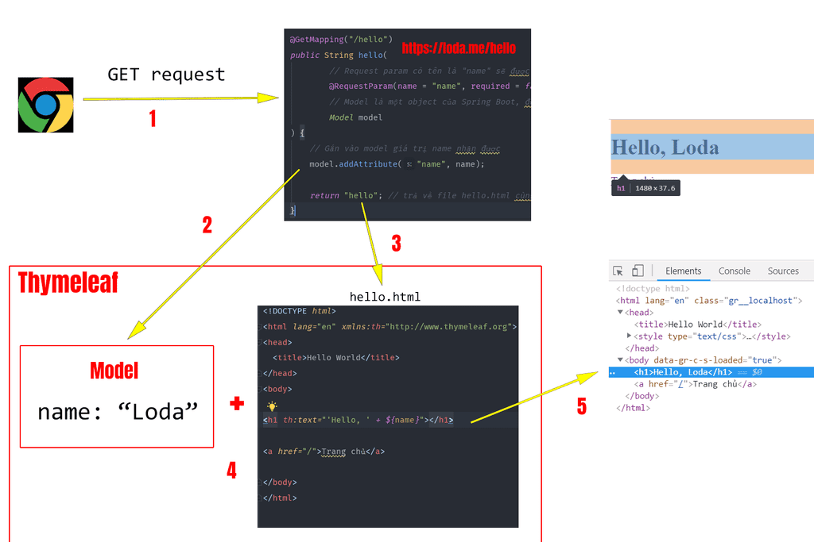

## Tạo Web Helloworld với @Controller + Thymeleaf
    - Nếu Java làm phía back-end -> thì Thymeleaf sẽ hỗ trợ làm giao diện nhanh hơn.
    - Bản chất của Controller là điều hướng các request.
    - Hỗ trợ đưa, lấy ra các yêu cầu của người dùng.

## Giới thiệu chung
    - 2 mục tiêu chính của Spring bổ trợ là:
        1. Làm lập trình Web
        2. Làm việc với RESTful Web Service.

## Cài đặt
    - Lấy bộ Spring Web + Thymeleaf
    - Bộ reload server -> DevTool

## Sử dụng Annotation Controller

## Hiểu về HTML
    - Tại sao lại sử dụng thêm cả Thymeleaf trong project hiện tại.
    - Cú pháp của Thymeleaf dùng là như nào.
    - Mục đích sử dụng của Thymeleaf là gì?

## Giải thích nguyên lý 1
    https://loda.me/articles/sb8-tao-web-helloworld-voi-controller-thymeleaf

    
## Ví dụ

## Giải thích nguyên lý 2
    https://loda.me/articles/sb8-tao-web-helloworld-voi-controller-thymeleaf

    
    Model ở đây là một Object được Spring Boot đính kèm trong mỗi response.
    Model chứa các thông tin mà bạn muốn trả về và Template Engine sẽ trích xuất thông tin này
        ra thành html và đưa cho người dùng.
    
    Lấy giá trị trong Module -> <h1 th:text="'Hello, ' + ${name}"></h1>
    
    
## Kết luận
    - Controller rất quan trọng

## Câu hỏi:
    1. Các syntax chính trong Template Enginer gồm có những gì?
    
    2. Có thể dùng Template Enginer - Thymeleaf này để generate dữ liệu báo cáo hay không?
        Nếu có thì cách làm như nào?
        TL:
    Nó sẽ lấy dữ liệu từ phía model -> nên khả năng lấy được là rất cao.
    