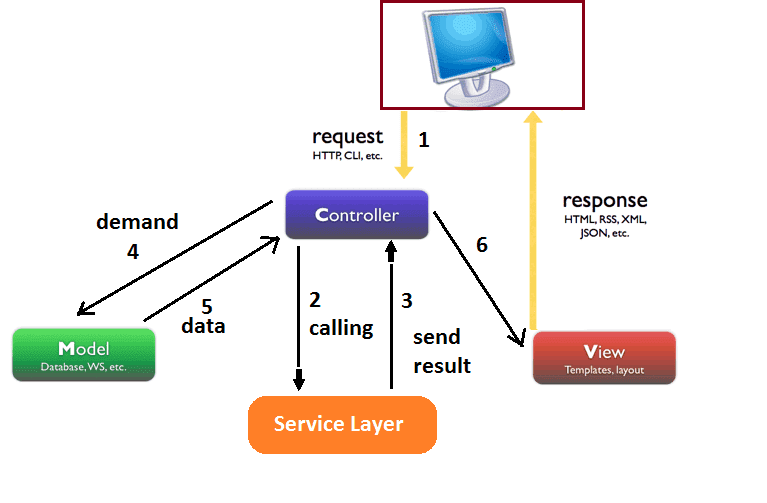

## Giới thiệu chung
    - Mục đích chính của nhiệm vụ làm Spring là:
        1. Lập trình Web
            Các thư mục template,service được đặt ở phần khác
            Cấu hình theo cách khác.
        2. Restful Web Service (Ưu tiên cao hơn)
    - Cụ thể hơn là làm việc với @Controller hoặc @RestController

## Nêu sự giống và khác nhau giữa: @Controller và @RestController.
    1. Khác nhau ở cách sử dụng

    2. Khác nhau ở cách tổ chức.
        + Controller tạo ra web trả về file xxx.html
        + RestController tạo ra các request + http method -> build Restful Web Service

## Cài đặt

## Về @Controller

## Về HTML
    Mặc định file html sẽ được lưu trong thư mục: resource/template
    Spring Boot + Thymeleaf sẽ tìm kiếm các file này theo tên.
    VD: index -> tương ứng với: index.html

## Ví dụ về Hello World

## Giải thích 1

## Ví dụ 2

## Giải thích 2

## Kết luận chung

