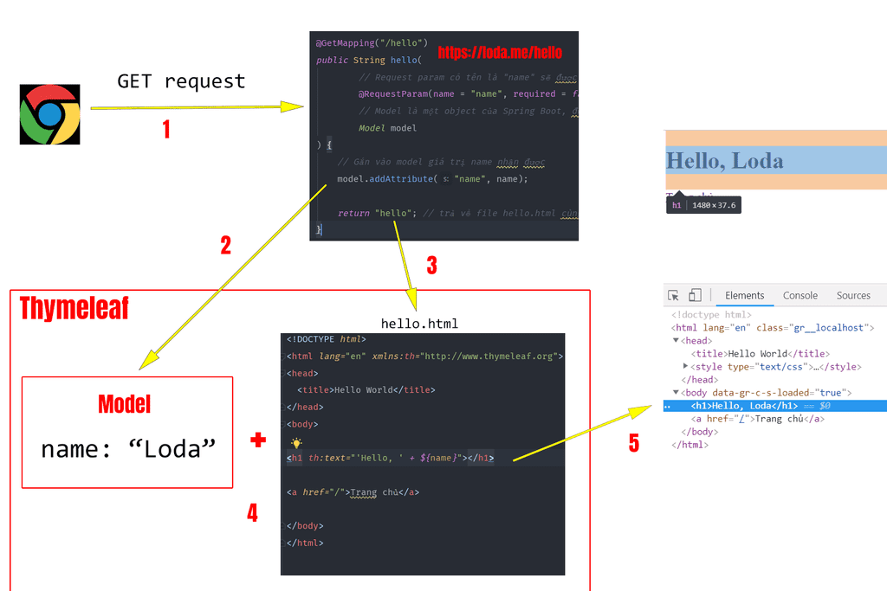

## Nội dung
    Giải thích cách Thymeleaf vận hành + Expression + Demo Full

## Giới thiệu về Thymeleaf
    - Mục đích của Thymeleaf là tạo ra file HTML -> từ các dữ liệu + template + quy tắc
    - Java Template Engine -> generate HTML, XML, ...
    File Html = data + teamplate + rule.

    - Cung cấp dữ liệu và quy định template như nào, còn việc dùng các thông tin đó để render ra HTML sẽ do Thymeleaf quyết định.

## Cú pháp:
    th: ---> gọi là attribute - Thuộc tính.
    Ưu điểm: bổ sung thêm theo về HTML
             Không phải bổ sung thêm syntax hay thẻ mới như JSP truyền thống.
    Ví dụ: <h1 th:text="${name}"></h1>

## Model & View trong Spring Boot
    - Model là đối tượng lưu giữ thông tin -> dùng cho các Template Engine -> để generate webpage.
    - Model lưu thông tin dưới dạng key-value
    - Sử dụng Thymeleaf Standard Expression
    - Trong template thymeleaf, để lấy các thông tin trong Model
        Sử dụng Thymeleaf Standard Expression.
    

## Danh sách các Expression trong Thymeleaf

### ${...} - Variables Expressions
    - Model sẽ add các data -> addAttribute("key", "Value")
        Ví dụ: model.addAttribute("today", "Monday");
    - Để lấy giá trị ra:
        
        Tương đương với: context.getVariable("today")

### *{...} - Variables Expressions on selections
    Chức năng giống với ${} -> lấy giá trị của một biến.
    Nhưng khác ở chỗ: là sẽ lấy giá trị của một biến cho trước bởi: th:object

### #{...} - Message Expression
    Lấy dữ liệu trong file .properties
    - Cách đặt giá trị trong xxx.properties
        home.welcome=kkdkdkdkd
    - Cách lấy giá trị từ file properties
        
Xin chao....

    Đoạn text trong cặp 
 sẽ được thay thế bởi dữ liệu mới -> khi render {home.welcome}

### @{...} - URL Expression
    - Mục đích: xử lý và trả ra giá trị URL theo context của máy chủ.

## Demo minh họa
    + add các thư viện: spring-boot-starter-thymeleaf
    + 

## Cấu hình Thymeleaf

## Static & template

## Thêm @Controller cho path/profile

## Reference Document
    「Spring Boot #9」 Giải thích cách Thymeleaf vận hành + Expression + Demo Full
        https://loda.netlify.app/spring-boot-9-giai-thich-cach-thymeleaf-van-hanh-expression-demo-full-loda1558267496214/

